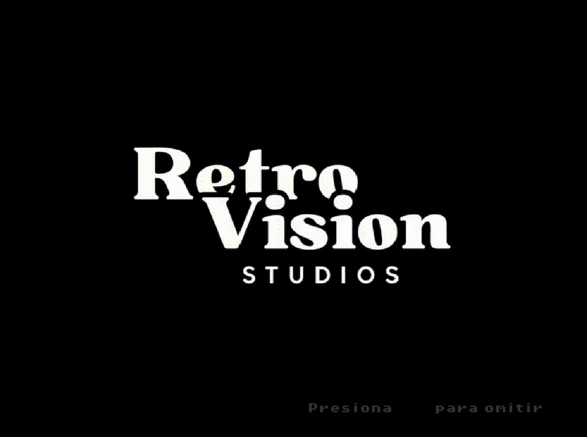
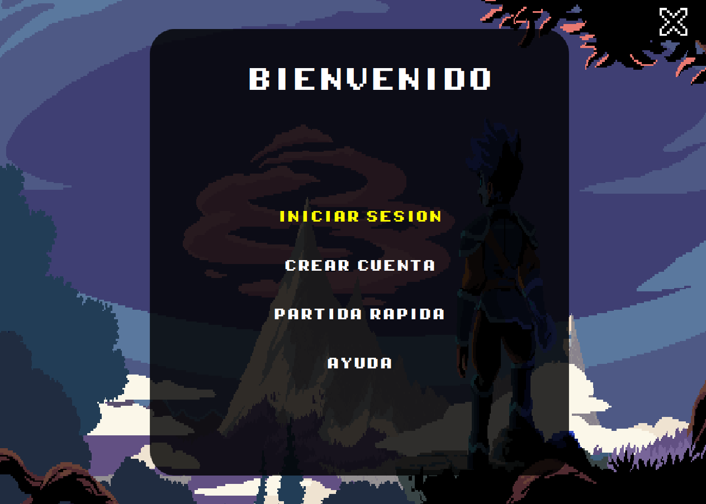
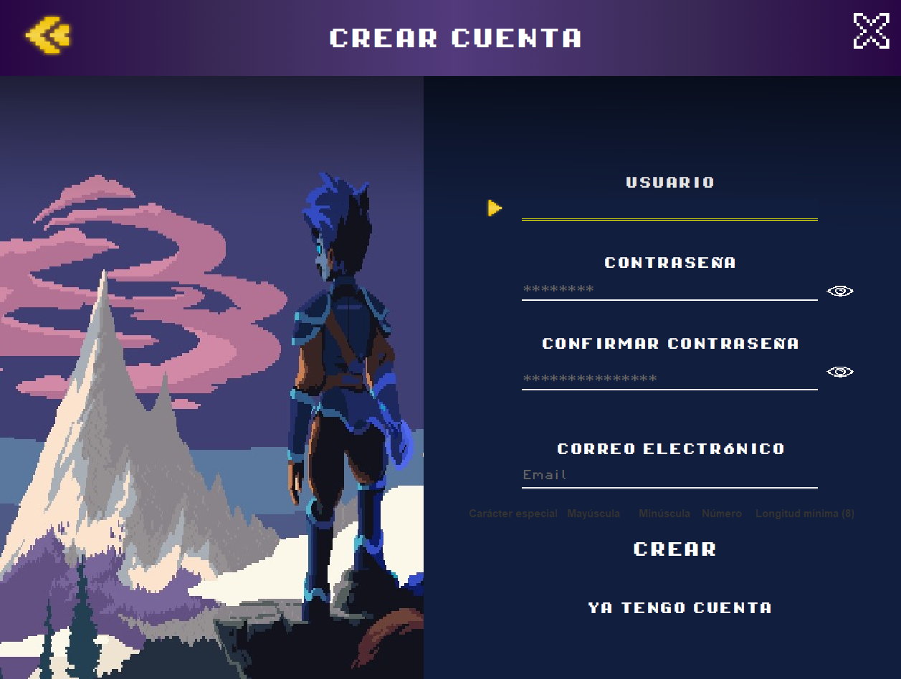
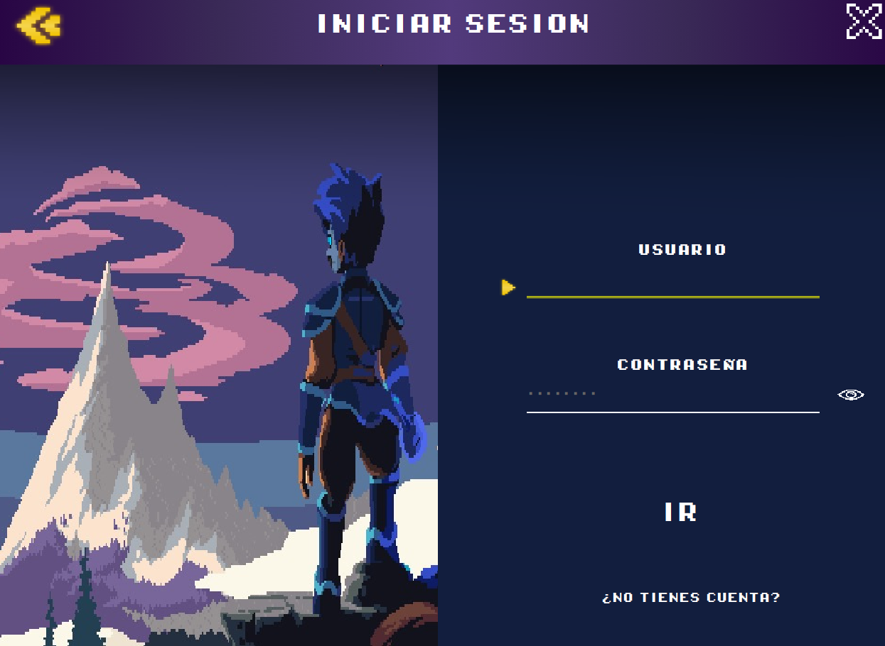
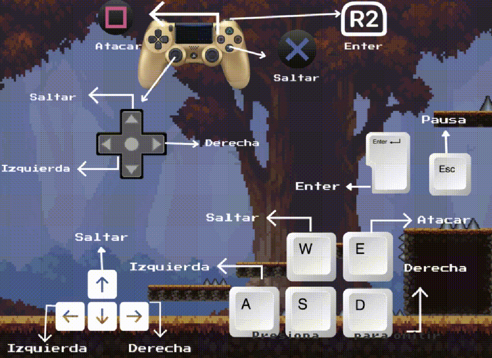
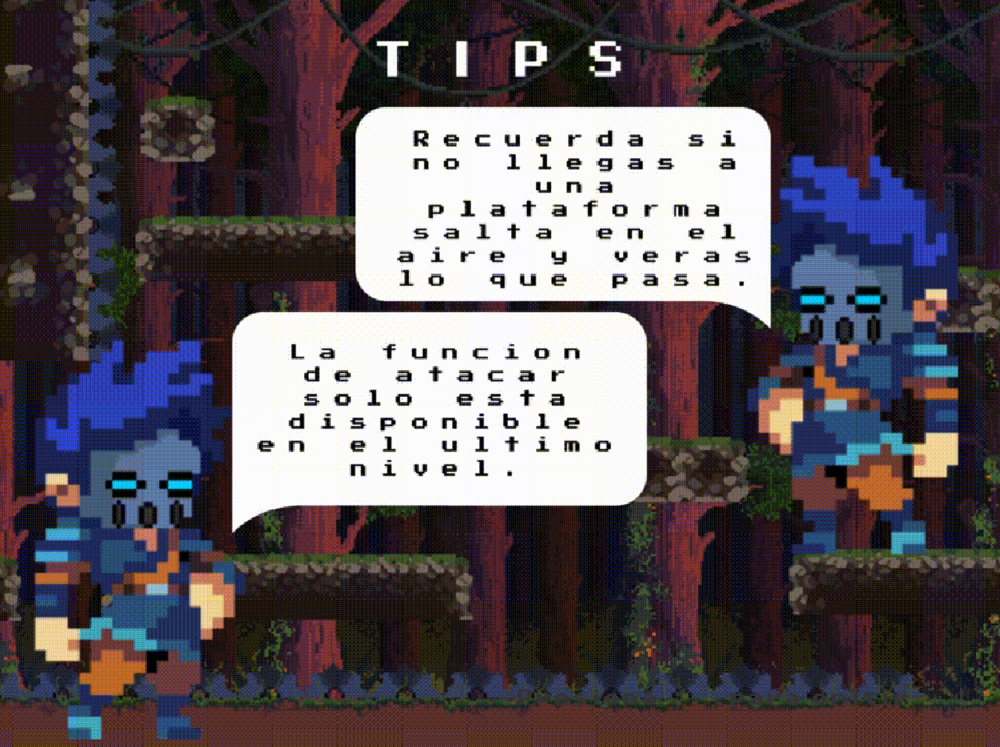
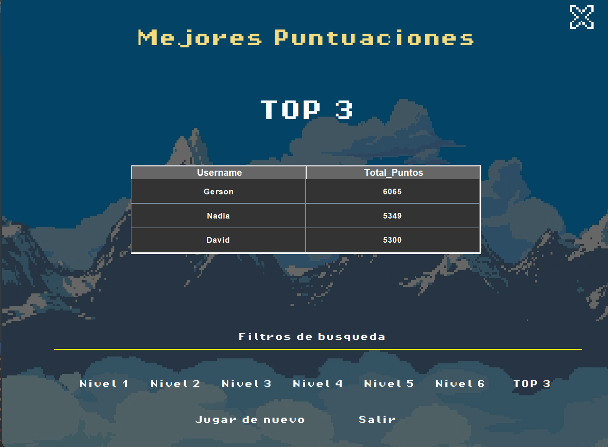
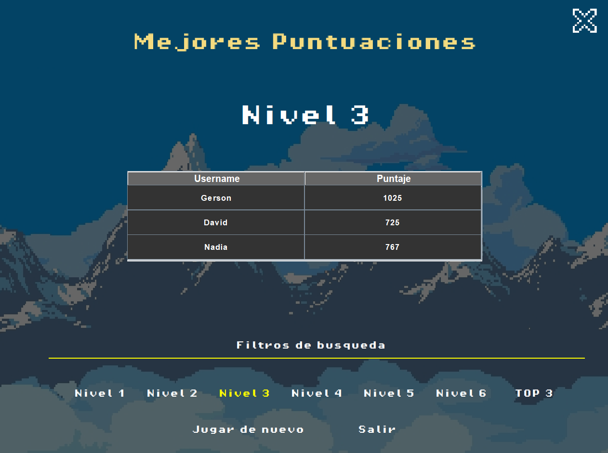
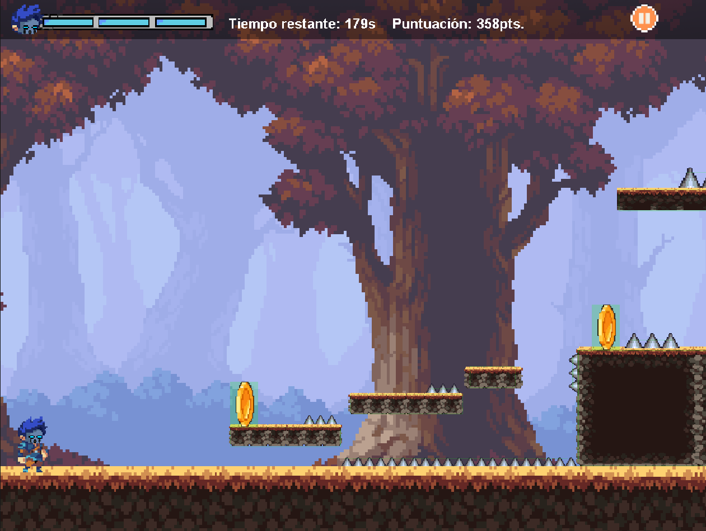

# Manual de Usuario - STARLIGHT

## Introducción
Starlight busca ofrecer una experiencia de entretenimiento única y divertida. 

## Objetivos
- Desarrollar un Entorno Dinámico.
- Implementación de un Sistema de Gestión.
- Proporcionar a los jugadores una plataforma entretenida que fomente la resolución de problemas y el pensamiento estratégico.
- Aplicar conocimientos de Java Swing.
- Crear una historia llamativa.

## Descripción de la Aplicación
Starlight consiste en un videojuego plataformero con diseño de 64 bits.

## Crear Cuenta e Iniciar Sesión
### Inicio de Sesión
- **Nombre de Usuario**
- **Contraseña**

### Creación de Cuenta
- **Nombre de usuario**
- **Correo electrónico**
- **Contraseña**
- **Confirmación de contraseña**

### El usuario puede filtrar puntajes por:
- Mejor puntuación por nivel.
- Mejor puntuación en general.

## Requisitos Técnicos
## Requisitos Mínimos:
- Procesador: Intel Core i3 o equivalente
- Memoria RAM: 4 GB
- Almacenamiento: 500 MB de espacio disponible
- Resolución de Pantalla: 1280x720 píxeles

## Requisitos Recomendados:
- Procesador: Intel Core i5 o superior
- Memoria RAM: 8 GB
- Almacenamiento: 1 GB de espacio disponible
- Tarjeta Gráfica: NVIDIA GeForce GTX 750 o superior
- Resolución de Pantalla: 1920x1080 píxeles

## Dependencias y Herramientas de Desarrollo
- Entorno de Desarrollo Integrado (IDE): IntelliJ IDEA, Eclipse, o NetBeans (solo para desarrollo)
- Control de Versiones: Git (solo para desarrollo)
- Herramientas de Compilación: Ant
- Sistemas de Gestión de Bases de Datos: SQL (MySQL)

## Base de Datos
- Sistema de Gestión de Bases de Datos (SGDB): SQL
- Requisitos de Almacenamiento: Espacio suficiente en disco para la base de datos (dependiendo DE LA cantidad de datos que se manejen)

## Uso de la Aplicación
### Acceso y Registro
1. **Inicio de sesión**: Ingrese su nombre de usuario y contraseña.
2. **Registro de nuevo usuario**: Complete el formulario de registro con los datos solicitados.

## Capturas de Pantalla y Descripción
1. **Splash Screen**


2. **Progress Bar**


3. **Pantalla Principal**


4. **Crear Cuenta**


5. **Iniciar Sesión**


6. **Ventana de Ayuda (controles)**


7. **Ventana de Ayuda (tips)**


8. **Ventana de puntajes**


9. **Filtar por nivel**


10. **Nivel 1**


```